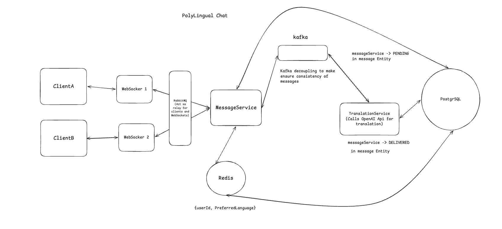

# 🌐 MultiLingual Chat App

A real-time chat application that breaks the language barrier — like WhatsApp, but with automatic translation powered by OpenAI.

**The idea:** Ajinkya speaks English, his friend Carlos speaks only Spanish. They can't chat. This app lets them — each user sets their preferred language once, and every message they receive is automatically translated into it. In real time.

## 📸 Demo

https://github.com/AjinkyaAmbadkar/MultiLingualChat-App/raw/main/docs/demo.mp4

> If the player above doesn't load, [download/view the demo here](docs/demo.mp4).

---

## 🛠️ Tech Stack

### Backend

| Layer       | Technology                                         |
| ----------- | -------------------------------------------------- |
| Language    | Java 21                                            |
| Framework   | Spring Boot 4.x (Spring Framework 7.x)             |
| Database    | PostgreSQL                                         |
| ORM         | Spring Data JPA / Hibernate 7                      |
| Real-time   | WebSocket + STOMP protocol (via SockJS)            |
| Translation | OpenAI GPT-4o-mini (Chat Completions API)          |
| HTTP Client | Spring `RestClient` (Spring 6.1+)                  |
| Security    | Spring Security 7 + JWT (JJWT 0.12.x)              |
| OAuth2      | Google Identity Services (frontend-initiated flow) |
| Logging     | SLF4J + Logback                                    |
| Build       | Maven                                              |

### Frontend

| Layer        | Technology                                          |
| ------------ | --------------------------------------------------- |
| Framework    | React 19 (Vite)                                     |
| Styling      | Tailwind CSS v4 + inline styles                     |
| WebSocket    | STOMP.js + SockJS client                            |
| Crypto       | Browser Web Crypto API (RSA-OAEP + AES-GCM decrypt) |

### Messaging, Cache & Infrastructure

| Concern             | Technology                                                        |
| ------------------- | ----------------------------------------------------------------- |
| STOMP broker        | RabbitMQ 3.13 (STOMP relay) — replaces in-memory simple broker    |
| Presence & cache    | Redis 7 (online presence + language cache, shared across nodes)   |
| Async translation   | Apache Kafka (KRaft mode) — message persistence + translation jobs |
| Load balancer       | HAProxy 2.9 — sticky sessions (required for SockJS)               |
| Edge / static serve | nginx (serves React build, proxies `/auth`,`/api`,`/ws`, TLS)     |
| Containerization    | Docker + Docker Compose                                            |
| Orchestration       | Kubernetes manifests (`k8s/`) — Deployment + HPA (autoscaling)    |
| Cloud host          | AWS EC2 (Ubuntu ARM64), full stack via Docker Compose             |

---

## ✅ Features

### Core
- **JWT Authentication** — register, login, refresh token, logout; BCrypt password hashing
- **Google OAuth2 Login** — frontend-initiated flow; server verifies Google ID token, issues own JWT pair
- **Language Preference** — each user sets their preferred language once; all incoming messages are translated into it automatically
- **Smart Translation** — OpenAI is called **only** when sender and receiver speak different languages; same-language chats have zero API cost
- **Sender-side translation + toggle** — the sender also sees their own message rendered in their preferred language, with a per-bubble **"See original / See translation"** toggle
- **Real-time Messaging** — WebSocket (STOMP over SockJS) pushes messages instantly to both sender and receiver
- **Conversation List** — sidebar shows all conversations with last message preview and localized timestamp
- **User Discovery** — "New Chat" modal lists all registered users with live search; click to open a chat
- **Profile / Settings** — settings modal to change preferred language (13 languages); profile picture from Google, initials-avatar fallback for email users
- **Message History** — full chat history loads when opening a conversation
- **Localized timestamps** — server stores/sends timestamps as UTC instants (`...Z`); the browser localizes to each user's timezone automatically
- **Session Persistence** — login state survives page refresh via localStorage
- **React Frontend** — full UI with login/register page, sidebar, chat window, message bubbles

### Real-time presence & delivery
- **Typing indicators** — debounced typing events over WebSocket; animated 3-dot bubble + "typing…" in the header
- **Online / offline presence** — Redis-backed; header shows green (online) / grey (offline); REST fallback on conversation open + live WebSocket updates
- **Read receipts** — grey ✓✓ delivered, green ✓✓ read; bulk-marked in DB and pushed to the sender in real time

### Security
- **End-to-end-style encryption at rest** — AES-256-GCM message bodies, RSA-2048 key wrapping, per-user keypairs, PBKDF2-derived private-key protection (see [Security Model](#-security-model))
- **Secure WebSocket** — JWT validated on STOMP CONNECT frame, not just HTTP; sender identity derived from JWT, never from client payload

### Scale & infrastructure
- **Multi-instance ready** — RabbitMQ STOMP relay + Redis presence/cache make the backend stateless, so it runs behind HAProxy with N replicas (cross-instance messaging verified)
- **Async translation pipeline** — messages quick-save as `PENDING`, translate via a Kafka consumer, then flip to `DELIVERED` and push over WebSocket (snappy send, no blocking on OpenAI)
- **Containerized + orchestrated** — one-command Docker Compose stack; Kubernetes manifests with an HPA that autoscales the backend on CPU
- **Deployed on AWS** — full stack on an EC2 ARM instance (see [Deployment & Scaling](#-deployment--scaling))

---

## 🏗️ Project Structure

```
MutiLingual Chat App/
├── backend/chat-app/
│   ├── .env                                          # ⚠️ Local secrets (never committed)
│   └── src/main/java/com/multilingual/chat/app/
│       ├── config/
│       │   ├── SecurityConfig.java                   # Spring Security filter chain
│       │   ├── WebSocketConfig.java                  # STOMP broker RELAY → RabbitMQ + JwtChannelInterceptor
│       │   ├── RedisConfig.java                      # Redis template + cache manager
│       │   ├── KafkaProducerConfig.java              # translation-jobs producer
│       │   └── KafkaConsumerConfig.java              # @EnableKafka consumer factory
│       ├── controller/
│       │   ├── AuthController.java                   # /auth/register, login, refresh, logout, google
│       │   ├── ChatWebSocketController.java          # @MessageMapping /chat.send, .typing, .read
│       │   ├── MessageController.java                # REST: send, history, conversations
│       │   └── UserController.java                   # REST: users, /me, language update, presence
│       ├── kafka/
│       │   ├── TranslationProducer.java              # publishes translation jobs
│       │   └── TranslationConsumer.java              # translates + re-encrypts → DELIVERED → WS push
│       ├── security/
│       │   ├── JwtService.java                       # Token generation & validation
│       │   ├── JwtAuthFilter.java                    # HTTP request JWT filter
│       │   ├── JwtChannelInterceptor.java            # STOMP CONNECT frame JWT validator
│       │   └── UserDetailsServiceImpl.java
│       ├── service/
│       │   ├── AuthService.java                      # Auth logic + Google token verification
│       │   ├── MessageService.java                   # Message + translation + conversation logic
│       │   ├── UserService.java                      # User CRUD + language update
│       │   ├── EncryptionService.java                # Hybrid AES-GCM + RSA-OAEP encrypt/decrypt
│       │   ├── PresenceService.java                  # Redis-backed online presence
│       │   ├── UserLanguageCacheService.java         # Redis cache: userId → preferredLanguage
│       │   ├── TranslationService.java               # Interface
│       │   └── impl/
│       │       ├── OpenAiTranslationServiceImpl.java # Real OpenAI integration (@Primary)
│       │       └── MockTranslationServiceImpl.java   # Stub for testing
│       ├── listener/
│       │   └── WebSocketEventListener.java           # SessionConnected/Disconnect → presence updates
│       ├── repository/
│       │   ├── MessageRepository.java                # Chat history + conversation list queries
│       │   ├── UserRepository.java
│       │   └── RefreshTokenRepository.java
│       ├── entity/
│       │   ├── User.java                             # + publicKey, encryptedPrivateKey, keySalt (encryption keypair)
│       │   ├── Message.java                          # encrypted blobs + AES keys/IVs, status, UTC timestamp
│       │   ├── MessageStatus.java                    # Enum: PENDING / DELIVERED
│       │   ├── RefreshToken.java
│       │   └── AuthProvider.java                     # Enum: LOCAL / GOOGLE
│       └── dto/
│           ├── AuthResponseDto.java                  # accessToken, refreshToken, userId, email, name, privateKey
│           ├── GoogleLoginRequestDto.java            # idToken (from Google Identity Services)
│           ├── SendMessageRequestDto.java            # receiverId + originalText only
│           ├── MessageResponseDto.java               # Encrypted blobs + AES keys/IVs; timestamp emitted as UTC instant
│           ├── ChatHistoryResponseDto.java           # History page payload
│           ├── ConversationDto.java                  # Sidebar entry: partner info + last message
│           ├── PresenceEventDto.java                 # type=PRESENCE online/offline events
│           ├── TypingEventDto.java                   # type=TYPING relay
│           ├── ReadReceiptDto.java                   # type=READ_RECEIPT readerId/senderId
│           ├── UserSummaryDto.java                   # Safe public user info (no passwordHash)
│           ├── RegisterRequestDto.java
│           ├── LoginRequestDto.java
│           └── RefreshTokenRequestDto.java
├── frontend/
│   ├── src/
│   │   ├── api/                    # auth.js, users.js, messages.js
│   │   ├── context/                # AuthContext.jsx, ChatContext.jsx
│   │   ├── hooks/                  # useWebSocket.js (send/typing/read, presence)
│   │   ├── components/
│   │   │   ├── Auth/               # AuthPage.jsx (login + register + Google)
│   │   │   ├── Sidebar/            # Sidebar, ConversationItem, NewChatModal, SettingsModal
│   │   │   └── Chat/               # ChatWindow, MessageBubble, MessageInput
│   │   ├── utils/
│   │   │   ├── time.js             # localized timestamp formatting
│   │   │   └── crypto.js           # importPrivateKey + decryptMessage (Web Crypto)
│   │   ├── App.jsx
│   │   └── main.jsx
│   ├── Dockerfile                  # multi-stage: build React → serve via nginx
│   ├── nginx.conf                  # static + proxy /auth,/api,/ws; TLS
│   ├── vite.config.js              # Tailwind plugin + proxy to :8080 + global shim
│   └── package.json
├── docker-compose.yml              # postgres, kafka, rabbitmq, redis, backend, haproxy, frontend
├── haproxy/haproxy.cfg             # sticky-session load balancer (server-template)
├── rabbitmq/enabled_plugins        # enables the STOMP plugin (port 61613)
├── k8s/                            # namespace, postgres, redis, rabbitmq, kafka, backend Deployment + HPA
├── .env.example                    # template (real values live in gitignored .env)
├── DB Files/
│   ├── initial_DB_setup.sql        # PostgreSQL user + database creation
│   └── auth_migration.sql          # Auth columns + refresh_tokens table
└── README.md
```

---

## ⚙️ Setup & Running

> **Fastest path:** if you just want the whole thing running, skip to [Deployment & Scaling](#-deployment--scaling) and use `docker compose up`. The steps below are for local development of the backend + frontend directly.

### Prerequisites

- Java 21+
- Maven
- PostgreSQL running locally
- OpenAI API key
- Google Cloud OAuth2 Client ID (Web application type)
- Node.js 18+ (for frontend)

### 1. Database setup

```sql
CREATE USER chatapp_user WITH PASSWORD 'your-password';
CREATE DATABASE chatapp OWNER chatapp_user;
GRANT ALL PRIVILEGES ON DATABASE chatapp TO chatapp_user;
GRANT ALL ON SCHEMA public TO chatapp_user;
```

Hibernate auto-creates all tables on first run via `ddl-auto=update`.

### 2. Create `.env` file

```bash
cd backend/chat-app
```

`backend/chat-app/.env`:

```
JWT_SECRET=<run: openssl rand -base64 32>
OPENAI_API_KEY=sk-your-openai-key-here
DB_PASSWORD=your-db-password-here
GOOGLE_CLIENT_ID=your-client-id.apps.googleusercontent.com
```

> `.env` is in `.gitignore` and will never be committed.

### 3. Google Cloud setup

1. Go to [Google Cloud Console](https://console.cloud.google.com) → APIs & Services → Credentials
2. Create an OAuth 2.0 Client ID (Web application type)
3. Add `http://localhost:3000` to **Authorized JavaScript origins**
4. Copy the Client ID into `.env` and into `frontend/src/components/Auth/AuthPage.jsx`

### 4. Start the backend

```bash
cd backend/chat-app
source .env && ./mvnw spring-boot:run
```

Backend starts at `http://localhost:8080`

### 5. Start the frontend

```bash
cd frontend
npm install
npm run dev
```

Frontend starts at `http://localhost:3000`

---

## 🔐 Authentication

### Email / Password

```
POST /auth/register  →  hash password → save user → issue JWT pair
POST /auth/login     →  verify credentials → issue JWT pair
POST /auth/refresh   →  validate refresh token → issue new access token
POST /auth/logout    →  revoke refresh token in DB
```

### Google OAuth2 (frontend-initiated)

```
Browser → Google Identity Services JS SDK → Google ID Token
       → POST /auth/google { idToken }
       → Server verifies token with Google tokeninfo endpoint
       → Checks aud == GOOGLE_CLIENT_ID, email_verified == true
       → Find or create User (provider=GOOGLE)
       → Issue same JWT pair as normal login
```

**Token lifetimes:**

- Access token: **15 minutes** (stateless, cannot be revoked)
- Refresh token: **7 days** (stored in DB, revoked on logout)

---

## 🌐 Message Flow (async, encrypted)



```
User A types "Hello"
        │
        ▼
ChatWebSocketController  (/app/chat.send)
        │
        ▼
MessageService.sendMessage(dto, senderEmail)
        │
        ├─ Look up sender by email from JWT (cannot be forged) + receiver by receiverId
        ├─ Encrypt originalText: fresh AES-256-GCM key, wrapped with BOTH users' RSA public keys
        ├─ Save Message as PENDING (UTC timestamp) to PostgreSQL
        ├─ Publish a job to Kafka topic `translation-jobs`
        └─ Quick ACK back to sender  →  UI feels instant (no OpenAI blocking)
                │
                ▼
TranslationConsumer  (Kafka @KafkaListener)
        │
        ├─ senderLang == receiverLang?
        │       YES → skip OpenAI, reuse original text  💰
        │       NO  → call OpenAI to translate          💸
        ├─ Re-encrypt all three text fields (original / translated / sender-view) with one fresh AES key
        ├─ Update Message → DELIVERED
        │
        └─ Push MessageResponseDto via the RabbitMQ STOMP relay to:
                /topic/user.{receiverId}  → receiver decrypts translated text (Web Crypto)
                /topic/user.{senderId}    → sender decrypts original / sender-view text
```

> The server only holds plaintext briefly in memory during the OpenAI step — it is never persisted. Clients decrypt in the browser with their in-memory RSA private key. The RabbitMQ relay (not an in-memory broker) is what lets a message reach a user connected to a *different* backend instance.

---

## 📡 API Reference

### Auth (public)

| Method | Endpoint         | Description                    |
| ------ | ---------------- | ------------------------------ |
| `POST` | `/auth/register` | Register with email + password |
| `POST` | `/auth/login`    | Login → returns JWT pair       |
| `POST` | `/auth/google`   | Login with Google ID token     |
| `POST` | `/auth/refresh`  | Get new access token           |
| `POST` | `/auth/logout`   | Revoke refresh token           |

### Users (require Bearer token)

| Method  | Endpoint                 | Description                          |
| ------- | ------------------------ | ------------------------------------ |
| `GET`   | `/api/users`             | List all users (safe — no passwords) |
| `GET`   | `/api/users/{id}`        | Get user by ID                       |
| `GET`   | `/api/users/me`          | Get current user's profile           |
| `PATCH` | `/api/users/me/language` | Update preferred language            |

### Messages (require Bearer token)

| Method | Endpoint                                  | Description               |
| ------ | ----------------------------------------- | ------------------------- |
| `POST` | `/api/messages/send`                      | Send a message (REST)     |
| `GET`  | `/api/messages/history?user1Id=&user2Id=` | Chat history              |
| `GET`  | `/api/messages/conversations`             | Sidebar conversation list |

### WebSocket (STOMP)

**Connect:** `ws://localhost:8080/ws` (SockJS)
Pass JWT in STOMP CONNECT headers: `Authorization: Bearer <token>`
The `/topic` destinations are served by a **RabbitMQ STOMP relay**, so messages fan out across all backend instances. Behind multiple replicas, HAProxy sticky sessions keep each SockJS client pinned to one instance.

| Direction       | Destination            | Purpose                                              |
| --------------- | ---------------------- | ---------------------------------------------------- |
| Client → Server | `/app/chat.send`       | Send `{ receiverId, originalText }`                  |
| Client → Server | `/app/chat.typing`     | Relay a typing event to the receiver                 |
| Client → Server | `/app/chat.read`       | Mark messages read; push receipt to the sender       |
| Server → Client | `/topic/user.{userId}` | Receive `MessageResponseDto` / presence / typing / read receipts |

---

## 🔑 Key Design Decisions

**Why language is stored on the user, not sent per message**
Per-message language selection is friction. Every user sets their preferred language once in their profile. The server reads both users' preferences on every message and decides whether translation is needed — the client never has to think about it.

**Why OpenAI is only called when languages differ**
Translation costs tokens. Two English speakers chatting would waste money on a no-op translation. The server compares sender and receiver languages first; if they match, the original text is delivered as-is.

**Why senderId is not in the message payload**
Any client could forge `senderId: 5` and send messages impersonating another user. The server derives the sender's identity exclusively from the JWT Principal set at STOMP CONNECT time — the client cannot override it.

**Why Google login uses the frontend-initiated flow**
Spring Security's server-side OAuth2 flow is designed around browser redirects and sessions. This app is JWT-based and stateless. The frontend-initiated flow (Google signs in, sends an ID token, server verifies it) maps cleanly onto the existing auth architecture without fighting the framework.

**Why JWT over sessions?**
Sessions require server-side state — a scaling problem. JWT is stateless: every token carries its own proof of authenticity, verified by signature math alone. No DB lookup per request.

---

## 🔐 Security Model

### Encryption at rest (Phase 8.5)

| Property            | Detail                                                                                                                    |
| ------------------- | ------------------------------------------------------------------------------------------------------------------------- |
| Message encryption  | AES-256-GCM per message, fresh key + unique IV per plaintext field                                                        |
| Key wrapping        | RSA-2048-OAEP (SHA-256) — AES key wrapped separately for sender and receiver                                              |
| Private key storage | PKCS#8 private key encrypted with AES-256-GCM; key derived via PBKDF2-HMAC-SHA256 (100,000 iterations) from user password |
| Key transport       | Plaintext private key returned to client on login/register over TLS; never persisted server-side                          |

### Trust boundary (honest documentation)

> **This is NOT end-to-end encryption.**

The server briefly holds plaintext message content in memory during the OpenAI translation step. Plaintext is never written to disk or logs, and variables are nulled after use — but an attacker with live memory access to the server process could read it.

**What the encryption protects against:** a database dump contains only ciphertext. Without the user's password (and thus their derived key), encrypted messages and private keys are computationally infeasible to read.

**What it does NOT protect against:** a compromised server process, a malicious server operator, or network interception without TLS.

### Key loss

Password loss = permanent message loss. There is no key recovery mechanism — storing a recovery key server-side would defeat the purpose of the encryption. Users must keep their password safe.

---

## 🚀 Deployment & Scaling

### Run the whole stack with Docker Compose

```bash
cp .env.example .env        # then fill in real secrets
docker compose up -d --build
```

This brings up **postgres, kafka, rabbitmq, redis, backend, haproxy (load balancer), and the nginx frontend**. The frontend serves on `:80` / `:443`; everything else stays on the internal Docker network.

Run multiple backend instances behind the sticky load balancer:

```bash
docker compose up -d --build --scale backend=2
```

Cross-instance messaging works because the backend is stateless: the STOMP broker is RabbitMQ (not in-memory), presence + language cache live in Redis, and HAProxy pins each browser to one instance via a `SERVERID` cookie (required for SockJS).

### Why each moving part exists

| Without it | Breaks at >1 instance |
| ---------- | --------------------- |
| RabbitMQ STOMP relay | An in-memory broker only delivers to clients on the *same* instance |
| Redis presence | In-memory presence map is per-instance — online status would be wrong |
| Redis cache | Per-instance language cache drifts; Redis is shared |
| HAProxy sticky sessions | SockJS makes multiple HTTP calls that must hit the same instance |

### Kubernetes

The `k8s/` manifests run the full stack in-cluster (namespace `chatapp`) with a backend **Deployment + HorizontalPodAutoscaler** (min 2 / max 6, scales on CPU). Verified on minikube: generated load drove the backend from 2 → 6 pods automatically. Stateful services run as pods with `emptyDir` (swap to PVCs for durability).

### AWS (current host)

Deployed on a single **EC2 t4g.medium (Ubuntu 24.04, ARM64, 4 GB)** in `us-east-1`, running the full Docker Compose stack with `restart: unless-stopped` (survives reboots). TLS is currently a **self-signed cert bound to the Elastic IP** — required because the browser's Web Crypto decryption needs a secure context. Adding a real domain (Route 53) + a trusted cert (Let's Encrypt/Caddy) is the next step, which also re-enables Google Sign-In (Google requires a registered domain origin).

---

## 🗺️ Roadmap

- [x] User management — CRUD, preferred language
- [x] JWT auth — register, login, refresh, logout
- [x] OpenAI server-side translation
- [x] WebSocket + STOMP real-time messaging
- [x] Secure WebSocket — JWT on STOMP CONNECT, sender derived from Principal
- [x] Google OAuth2 login (frontend-initiated)
- [x] Language preference system — server derives languages from profiles, smart OpenAI cost control
- [x] Sender-side translation + per-bubble original/translation toggle
- [x] React + Tailwind frontend — login, sidebar, chat window, new chat modal
- [x] Conversation list API
- [x] Encryption at rest — AES-256-GCM + RSA-2048, per-user keypairs, PBKDF2 key derivation
- [x] Typing indicators over WebSocket
- [x] Message read receipts (delivered / read ✓✓)
- [x] Online / offline presence (Redis-backed)
- [x] User profile / settings page (change language)
- [x] Swap in-memory STOMP broker for RabbitMQ + Redis presence/cache (production scale)
- [x] Async translation pipeline via Kafka (PENDING → DELIVERED)
- [x] Sticky-session load balancing (HAProxy) + verified multi-instance messaging
- [x] Docker containerization (Docker Compose)
- [x] Kubernetes manifests — backend Deployment + HPA autoscaling
- [x] Cloud deployment — AWS EC2 (ARM), full stack, self-signed TLS
- [x] Localized message timestamps (UTC on the wire, browser-localized)
- [ ] Custom domain (Route 53) + Let's Encrypt TLS → re-enable Google Sign-In in prod
- [ ] Editable display name on the profile page
- [ ] Migrate stateful K8s services to PVCs; resolve Kafka-in-cluster (Strimzi/Bitnami)
- [ ] ~~Group chat support~~ (out of scope)

---

## 👨‍💻 Developer

**Ajinkya Ambadkar** — Built during Masters (2026) to stay sharp with Java + Spring Boot while exploring real-time systems and LLM integration.
